 HUB
# Análisis computacional-cognitivo-conductual del juego de cartas Truco Argentino.

 

[DESAFÍO] **¿Cómo podríamos que hacer que una computadora juegue mejor que un humano al truco?**
¿Podríamos crear una IA para el truco?

**Resumen:** El Truco es un juego de cartas Argentino popularmente jugado en el todo el país y el cono sur. 
Es un juego de estrategia competitivo basado en turnos, de suma cero, estados finitos e información incompleta, lo cúal quiere decir que los jugadores basaran sus estrategias en base a especulaciones en cuanto a las cartas de los demas.
En los últimos tiempos, han existido numerosos artículos científicos implementando modelos de aprendizaje reforzado en juegos de dichas características. No obstante, aún no hay ningún trabajo que haya analizado este particular juego Argentino.
El próposito de este proyecto es analizar este juego desde un aspecto computacional para poder, luego, modelar un agente de aprendizaje reforzado.
Para dicho fin, primero vamos a hacer una revisión de los trabajos científicos en juegos similares (como el poker), luego conceptualizar algunos términos clave para abordar dicho problema, proponemos en este trabajo un modelado del oponente en función del comportamiento y estilo cognitivo de jugadores de truco y finalmente, invitamos a la comunidad al involucramiento en el desarrollo de un agente de aprendizaje reforzado para resolver este problema. ¿Cuál creen qué es el mejor enfoque para abordar el problema? ¿Qué algoritmo usarías?


**Nota:** Estamos analizando el truco Argentino **sin** flor y de **a dos** jugadores.

## ¿Cómo contribuir?

* Si te interesa participar simplemente clona este repositorio y unite al slack **haciendo clic** a este link: http://iaar-slack.herokuapp.com/
* Si ya estas en slack podes ingresar con este link: http://iaar.slack.com

## Facilitador

Patricio J. Gerpe

## Preliminares
### Revisión de literatura

En tanto no se han encontrado artículos científicos en respecto al juego de cartas 'Truco' sí existe artículos cientificos que abordan juegos de cartas de información imperfecta tal como el Poker.
Ejemplos incluyen:

* Heinrich, J., & Silver, D. (2016). Deep reinforcement learning from self-play in imperfect-information games. arXiv preprint arXiv:1603.01121. https://arxiv.org/pdf/1603.01121.pdf
* Mealing, R., & Shapiro, J. L. (2017). Opponent Modeling by Expectation-Maximization and Sequence Prediction in Simplified Poker. IEEE Trans. Comput. Intellig. and AI in Games, 9(1), 11-24.
* Kitchen, A., & Benedetti, M. (2018). ExpIt-OOS: Towards Learning from Planning in Imperfect Information Games. arXiv preprint arXiv:1808.10120. https://arxiv.org/pdf/1808.10120.pdf
* Yakovenko, N., Cao, L., Raffel, C., & Fan, J. (2016, February). Poker-CNN: A Pattern Learning Strategy for Making Draws and Bets in Poker Games Using Convolutional Networks. In AAAI (pp. 360-368).
* Ganzfried, S., & Yusuf, F. (2017). Computing human-understandable strategies: Deducing fundamental rules of poker strategy. Games, 8(4), 49.
* Bowling, M., Burch, N., Johanson, M., & Tammelin, O. (2017). Heads-up limit hold'em poker is solved. Communications of the ACM, 60(11), 81-88.
* Li, X., & Miikkulainen, R. (2018, July). Opponent modeling and exploitation in poker using evolved recurrent neural networks. In Proceedings of the Genetic and Evolutionary Computation Conference (pp. 189-196). ACM.
* Dahl, F. A. (2001, September). A reinforcement learning algorithm applied to simplified two-player Texas Hold’em poker. In European Conference on Machine Learning (pp. 85-96). Springer, Berlin, Heidelberg.
* Teófilo, L. F., Passos, N., Reis, L. P., & Cardoso, H. L. (2012). Adapting strategies to opponent models in incomplete information games: a reinforcement learning approach for poker. In Autonomous and Intelligent Systems (pp. 220-227). Springer, Berlin, Heidelberg.
* Erev, I., & Barron, G. (2005). On adaptation, maximization, and reinforcement learning among cognitive strategies. Psychological review, 112(4), 912. https://www.researchgate.net/profile/Ido_Erev/publication/7505648_On_Adaptation_Maximization_and_Reinforcement_Learning_Among_Cognitive_Strategies/links/00b49524696d50e515000000.pdf
* Szita, I. (2012). Reinforcement learning in games. In Reinforcement Learning (pp. 539-577). Springer, Berlin, Heidelberg.
* Kovacic, M. (2015). Opponent Modelling in Games with Imperfect Information.
* Hernandez-Leal, P., Taylor, M. E., Rosman, B., Sucar, L. E., & Munoz de Cote, E. (2016). Identifying and tracking switching, non-stationary opponents: A Bayesian approach.
* Albrecht, S. V., & Stone, P. (2018). Autonomous agents modelling other agents: A comprehensive survey and open problems. Artificial Intelligence, 258, 66-95.
* Kawamura, K., Mizukami, N., & Tsuruoka, Y. (2017, August). Neural Fictitious Self-Play in Imperfect Information Games with Many Players. In Workshop on Computer Games (pp. 61-74). Springer, Cham.
* Ponsen, M. J., Gerritsen, G., & Chaslot, G. (2010). Integrating Opponent Models with Monte-Carlo Tree Search in Poker. Interactive Decision Theory and Game Theory, 82.
* Bard, N., & Bowling, M. (2007, July). Particle filtering for dynamic agent modelling in simplified poker. In Proceedings of the National Conference on Artificial Intelligence (Vol. 22, No. 1, p. 515). Menlo Park, CA; Cambridge, MA; London; AAAI Press; MIT Press; 1999.
* Hernandez-Leal, P., Zhan, Y., Taylor, M. E., Sucar, L. E., & de Cote, E. M. (2017). An exploration strategy for non-stationary opponents. Autonomous Agents and Multi-Agent Systems, 31(5), 971-1002.


### Conceptos Clave

* **Modelado del oponente**:
Dado que no podemos saber qué cartas tiene nuestro oponente es necesario poder modelar el estilo del juego del mismo.
El modelado del oponente busca clasificar a nuestro oponente en base a su estilo estilo cognitivo (Toma deciciones de manera racional VS toma decisiones de manera intuitiva) así como su comportamiento. ¿Con qué frecuencia el oponente cambia su estilo de juego? 
¿Cuál es la frecuencia en la qué miente? ¿Tiene predominancia el comportamiento agresivo (Ejem.: Aumentar apuestas) o el comportamiento defensivo (Ejem.: Rechazar apuestas en contextos de malas cartas).

* **Equilibrio de Nash**:
Se llama equilibrio de Nash a  situaciones en las que las decisiones que ambos jugadores tomaron no pudiesen haber maximizado la utilidad para ambos de otra mejor alternativa.

* **Valor esperado**:
El Valor Esperado (VE) o Expected Value (VE) en el truco se refiere a la expectativa promedio de puntos que un jugador o equipo puede ganar o perder como resultado de una acción específica, considerando todas las posibles situaciones y sus probabilidades asociadas.

EV=(p1×r1)+(p2×r2)+...+(pn×rn)

donde:

� p es la probabilidad de un resultado específico.
� r es el resultado asociado con esa probabilidad (ganancia o pérdida de puntos).
� n es el número total de resultados posibles.

* **Expectativa positiva**:
Una acción tiene expectativa positiva (VE+) o EV+ (Expected Value Positive) cuando el EV es positivo, es decir, cuando la expectativa promedio es ganar más puntos de los que se pierden. Tomar decisiones con EV+ a lo largo del juego ayuda a maximizar las ganancias a largo plazo.

* **Expectativa negativa **:

En el truco argentino, el término EV- (Expected Value Negative) se refiere a una situación en la que el valor esperado (EV) de una acción o decisión es negativo. Esto significa que, en promedio y a largo plazo, esa acción resultará en una pérdida neta de puntos. Tomar decisiones con EV- tiende a ser perjudicial para el jugador o equipo, ya que conduce a pérdidas acumuladas con el tiempo.

* **Teorema fundamental del Poker.** (Aplica para el Truco)
El Teorema Fundamental del Poker, formulado por David Sklansky, establece que cada vez que juegas una mano de manera diferente a como lo habrías hecho si pudieras ver las cartas de tu oponente, él gana; y cada vez que juegas tu mano de la misma manera que lo habrías hecho si pudieras ver sus cartas, tú ganas. Aunque el truco argentino y el poker son juegos diferentes, el teorema puede aplicarse de manera similar para mejorar la toma de decisiones estratégicas en el truco. En el truco, como en el poker, se toman decisiones basadas en información imperfecta. No puedes ver las cartas de tu oponente, pero puedes hacer inferencias basadas en sus acciones y en la información disponible (tus cartas, las cartas jugadas, las apuestas, etc.).

Componentes del Teorema en el Truco
Lectura del Oponente:

Acciones del Oponente: Observar y analizar las acciones del oponente (por ejemplo, si canta envido, truco, o re truco) para inferir la fuerza de sus cartas.
Patrones de Juego: Identificar patrones de juego que puedan indicar una mano fuerte o débil.
Juego Óptimo Basado en Información:

Simular la Visión de las Cartas del Oponente: Intentar jugar tus manos como si pudieras ver las cartas del oponente, basándote en las inferencias de sus acciones y patrones.
Responder a Apuestas: Tomar decisiones sobre aceptar, rechazar, o subir apuestas basándote en la evaluación de la probabilidad de tener una mano mejor que la del oponente.
Maximización de Ganancias y Minimización de Pérdidas:

Aprovechar Oportunidades: Si tus inferencias sugieren que tienes una mano superior, realizar acciones que maximicen tus ganancias (cantar truco, re truco, etc.).
Minimizar Pérdidas: Si las acciones del oponente sugieren que tiene una mano más fuerte, evitar apuestas altas o retirarse para minimizar pérdidas.

* **Pozo del juego (Game's Equity)**:
El pozo del juego es la cantidad de puntos en juego durante la partida. (Ejemplo: Si se canta truco y re truco serán 3).

* **Pozo del jugador (Player's equity)**:
El pozo del jugador es el pozo del juego multiplicado por la probabilidad del jugador de ganar sobre el pozo del juego multiplicado por la probabilidad del jugador de perder.


* **Valor de la mano (Hand's value)**:
Es un puntaje obtenido en base a la posición de las cartas en función del truco y los tantos multiplicado por la probabilidad de obtenerlos.

* **Combinatoria:**
Es el estudio de la probabilidad de obtener diferentes manos en particular.

* **Set de información (Information set):**
Es la información que el agente conoce en cierto estado del juego.

* **Árbol de juego (Game Tree):**
Es el esquema en el cuál se dan los posibles cursos de acción en el juego.

* **Persona:**
Modelado de distintos perfiles de estrategia y/o personalidad de oponentes.

* **Rango de manos:**
Modelado deductivo del posible rango de manos que tiene nuestro oponente en función de la información disponible en el juego.

## Modelado de cartas y manos.

**P = Probabilidad**


### Cartas

Cartas del truco:

```python
# Modelo de carta
def crear_carta(numero, palo):
    return {"numero": numero, "palo": palo}

# Definición de los palos
palos = ["Espada", "Basto", "Oro", "Copa"]

# Creación del array de cartas
mazo = []
for palo in palos:
    for numero in range(1, 8):
        mazo.append(crear_carta(numero, palo))
    for numero in range(10, 13):
        mazo.append(crear_carta(numero, palo))

# Mostrar el mazo completo
for carta in mazo:
    print(carta)
```

Vamos a usar lógica difusa para clasificar nuestras cartas:

####  P d/ derrotar a otra carta       
| Expresión matemática       | Término linguístico       | 
| ------------- |:-------------:|
| A = 1      				 | Absoluta     |
| A = 0.93      				 | Casi Absoluta      |
| A = (0.78, 0.86)      				 | Muy alta     |
| A = (0.57, 0.71)      				 | Alta     |
| A = (0.35, 0.50)      				 | Media     |
| A = (0, 0.21)      				 | Baja     |


#### P d/ obtener carta      
| Expresión matemática       | Término linguístico       | 
| ------------- |:-------------:|
| A = 0.277     				 | Alta      |
| A = 0.146      				 | Media     |
| A = 0.075      				 | Baja    |

### ¿Cómo obtener la probabilidad de obtener una carta?

Si tengo un mazo de cartas españolas de 40 cartas y deseo obtener la probabilidad de obtener una carta determinada sacando una carta del mazo, simplemente debó contar los casos favorables sobre el total de los casos.

Sea evento **A** = Sacar ancho de espada (Hay un caso éxitoso sobre 40 casos posibles).

**P(A) = 1 / 40 = 0.025**

Sea evento **B** = Sacar algún 4. (Hay 4 casos posibles sobre 40 cartas totales).

**P(B) = 4 / 40 = 0.025**

Ahora bien, este cálculo solo nos esta indicando la probabilidad de sacar alguna o algunas cartas en una sola tirada con el mazo completo. No obstante, en el truco, se reparten 3 cartas a cada jugador. Al repartir esas cartas, estas no se reponen en el mazo, si no que pertenecen a la mano de dicho jugador.

Entonces, si deseamos obtener la probabilidad de obtener una carta o tipo de cartas en particular en mi mano, será necesario, pensar en una distribución de **probabilidad hipergeometrica**. (https://es.wikipedia.org/wiki/Distribuci%C3%B3n_hipergeom%C3%A9trica).


Dado una población **N** de **40** cartas, donde tenemos **1** solo caso éxitoso **M** en nuestra población (hay un solo ancho de espada en un mazo de 40 cartas españolas), y tengo un tamaño muestral **n** de **3** cartas (una mano tiene 3 cartas), deseo saber la probabilidad de qué exista un **1** caso éxitoso **x** en mi muestra n.

Es decir:

**X∼Hipergeometrica (N = 40, M = 1, n = 1)**

Probabilidad de que me toqué el ancho en mi mano:

**P(X=1)** = **0.07500**

Por su parte, si quisieramos cálcular la probabilidad que nos toque algún cuatro, se pensaría de la siguiente manera:

Dado una población **N** de **40** cartas, donde tenemos **4** solo caso éxitoso **M** en nuestra población N (tenemos un cuatro de cada palo en un mazo de 40 cartas españolas), y tengo un tamaño muestral **n** de **3** cartas (una mano tiene 3 cartas), deseo saber la probabilidad de qué exista un **1** caso éxitoso **x** (qué me toque algún cuatro) en mi muestra n.

Es decir:

**X∼Hipergeometrica (N = 40, M = 4, n = 1)**

Probabilidad de que me toqué el ancho en mi mano:

**P(X=1)** = **0.25506**


Vamos a rankear las cartas:

| Carta         | Ranking       | P d/ derrotar a otra carta  | P d/ obtener carta  |
| ------------- |:-------------:|:-----:|:-----:|
|   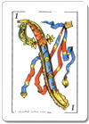 																				  | 1 | 1.0 |  0.075 |
| 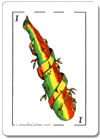     																				 | 2     |   0.97 | 0.075 |
| 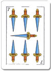  																					   | 3      |    0.95 | 0.075 |
| 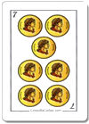   																					  | 4      |    0.92 | 0.075 |
| 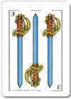 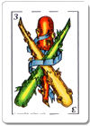 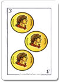 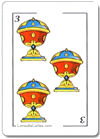       | 5      |    0.82 | 0.255|
| 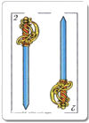 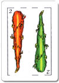 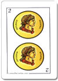 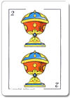       | 6      |    0.72 | 0.255 |
| 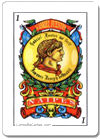 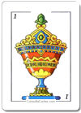     														  | 7      |    0.66 | 0.142 |
| 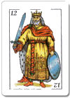 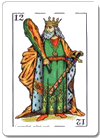 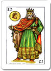 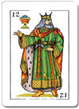       | 8      |    0.56 | 0.255 |
| 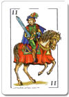 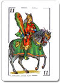 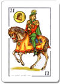 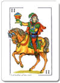       | 9      |    0.46 | 0.255 |
| 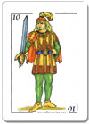 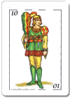 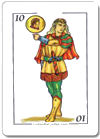 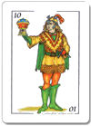       | 10      |    0.36 | 0.255 |
|  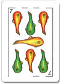         															| 11      |    0.31 | 0.142 |
|  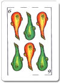 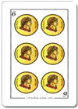 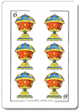       | 12      |    0.21 | 0.255 |
| 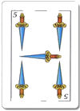 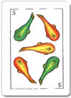 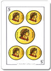 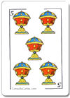       | 13      |    0.10 | 0.255 |
| 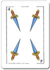 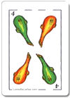 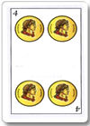 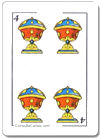       | 14      |    0 | 0.255 |

Formula de p/d ganar:

`casos en los que gana la carta / total de casos.`

```python
def ranking_card():
    """
    4s --> 0
    Ancho de Espada --> 13
    """
    if numero == 4:
        return 14
    elif numero == 5:
        return 13
    elif numero == 6:
        return 12
    elif numero == 7:
        if palo in ["basto", "copa"]:
            return 11
        elif palo == "oro":
            return 4
        else:  # espada
            return 3
    elif numero == 10:
        return 10
    elif numero == 11:
        return 9
    elif number == 12:
        return 8
    elif numero == 1:
        if stick in ["oro", "copa"]:
            return 7
        elif stick == "basto":
            return 2
        else:  # espada
            return 1
    elif numero == 2:
        return 6
    elif numero == 3:
        return 5
    else:
        return 1
```

### Combinatoria de manos

Ahora, ¿cuántas son las manos son posibles de obtener?

Fórmula: 

`P = 40! / (40 - 3)! =  40! / 37! = (40 * 39 * 38) / 6 = 9,880`

**9,880** son la cantidad de combinaciones posibles que tenemos. Es un número muy grande así que vamos a clasificar esas manos con el uso de lógica difusa.

Sí consideramos la diferentes combinación en función de si sos mano o pie las posibilidades son:

`9880 * 2 =` **19,760**

```python
from itertools import combinations

# Modelo de carta
def crear_carta(numero, palo):
    return {"numero": numero, "palo": palo}

# Crear el mazo
def crear_mazo():
    palos = ["Espada", "Basto", "Oro", "Copa"]
    mazo = []
    for palo in palos:
        for numero in range(1, 8):
            mazo.append(crear_carta(numero, palo))
        for numero in range(10, 13):
            mazo.append(crear_carta(numero, palo))
    return mazo

# Generar todas las combinaciones posibles de manos de 3 cartas
def generar_todas_las_manos(mazo):
    return list(combinations(mazo, 3))

# Crear el mazo
mazo = crear_mazo()

# Generar todas las manos posibles
todas_las_manos = generar_todas_las_manos(mazo)

# Mostrar algunas de las manos generadas
for mano in todas_las_manos[:5]:  # Mostrar solo las primeras 5 manos para ejemplo
    print(mano)
```


### Combinatoria de manos 1v1
El primer jugador puede tener 9,880 manos distintas.
El segundo jugador puede tener entonces:
`P = 37! / (37 - 3)! =  37! / 34! = (37 * 36 * 35) / 6 = 7,770`

**7,770** son la cantidad de combinaciones posibles de la mano del segundo jugador.
Esto da un total de 9,880 * 7,770 = **76.767.600** manos diferentes al jugar 1v1.

Vamos a clasificar la mano por:

* (A) Su valor en el juego del envido.
* (B) Su valor en el juego del truco.


Vamos por su valor en el **envido**:

E = **Envido**
m = 'Soy mano'
p = 'Soy pie'

| Expresión matemática       | Puntaje  |     Término linguístico       |  P de ganar       | Término linguístico       | 
| ------------- |:-------------:| ------------- | ------------- |:-------------:|
| Em = 33      					| 21	 | Máximo     | 1.0 | Absoluta |
| Ep = 33      					| 21 |      | 0.95 | Casi Absoluta |
| Em = (28, 32)      			|	(16,20) | Muy Alto    | 0.85~ | Muy Alta |
| Ep = (28, 32)      			|	(16,20) |      | 0.80~ | |
| Em = (26, 27)      			|	(14,15) | Alto     | 0.66~ | Alta |
| Ep = (26, 27)      			|	(14,15) |      | 0.64~ |  |
| Em = (20, 25)      			|	(8,13) | Bajo     | 0.50~ | Media |
| Ep = (20, 25)      			|	(8,13) |      | 0.45~ | |
| Em = (1, 7)      				|	(1,7) | Muy Bajo   | 0.19~ | Muy baja |
| Ep = (1, 7)      				|	(1,7) |     | 0.14~ | |


Probabilidad de ganar se calcula en base al total de casos que mi mano puede ganar el envido sobre el total de casos posibles de envido que tenga el oponente

Casos posibles =
`[33,32,31,30,29,28,27,26,25,24,23,22,21,20,7,6,5,4,3,2,1]`


|Puntaje|Frecuencia|
| ----- |:--------:|
|0 puntos  |112|
|1 puntos  |148|
|2 puntos  |244|
|3 puntos  |364|
|4 puntos  |504|
|5 puntos  |676|
|6 puntos  |868|
|7 puntos  |1084|
|20 puntos |364|
|21 puntos |372|
|22 puntos |372|
|23 puntos |504|
|24 puntos |504|
|25 puntos |640|
|26 puntos |640|
|27 puntos |780|
|28 puntos |408|
|29 puntos |420|
|30 puntos |284|
|31 puntos |292|
|32 puntos |148|
|33 puntos |152|
|total   |9,880|

Sí tengo 32 y soy mano entonces mis probabilidades de ganar son que el rival NO tenga 33. (9,880-152)/9,880 = 0.9846 (*)
*Nota: en realidad son más, dado que para tener 32 debo tener un 7, lo cual disminuye los 152 casos del rival.

Para los que sean intervalos, calculamos para cada caso y luego computamos promedio.

Ejemplo:

Em = (28, 32)
Ep = (28, 32)

`P(g)Em = recalcular 
P(g)Ep = recalcular`


### ¿Cómo cálcular probabilidad de envido?

En una partida de truco tal como en muchos juegos de cartas, se reparte una cierta cantidad determinada de cartas a cada jugador *sin reposición* de las mismas. Dada esa dinámica, si deseamos cálcular la probabilidad de obtener ciertas cartas (éxito) dentro de una muestra en particular (mano), como dijimos anteriormente la distribución apropiada es la hipergeométrica.

Entonces podemos definir a la variable aleatoria X como la cantidad de cartas de palo en particular de mi mano:
**X∼Hipergeometrica (N = 40, M = 10, n = 3)**

Es decir, sea X una variable aleatoria de distribución de probabilidad hipergeometrica con una población de 40 cartas (mazo), unas 10 cartas de de un palo (por ejem, espada) y una muestra de 3 cartas (mano). Queremos saber...

**P(X>=2) = ?**

En otras palabras, la probabilidad que X sea mayor 2 (que el número de cartas de un palo de mi mazo sea dos o tres).


Aplicando la formula de distribución hipergeometrica, eso da: 

**P(X ≥ 2): 0.14879**

Ahora bien, a nosotros nos interesa cálcular la probabilidad que nos toqué dos o tres cartas del mismo palo, no solo de un palo en particular (espada como pusimos en el ejemplo).

Es decir, la probabilidad de tener dos o más cartas de espada en nuestra mano, o bien dos o más cartas de basto, o bien dos o más cartas de oro, o bien dos o más cartas de copa, siendo estos eventos mutuamente excluyentes.

**P(XEspada >= 2) ∪ P(XBasto >= 2) ∪ P(XOro >= 2) ∪ P(XCopa >= 2) = P(XEspada >= 2) + P(XBasto >= 2) + P(XOro >= 2) + P(XCopa >= 2)**

**P(XEspada >= 2) ∪ P(XBasto >= 2) ∪ P(XOro >= 2) ∪ P(XCopa >= 2) = 0.14879 + 0.14879 + 0.14879 + 0.14879**

**P(XEspada >= 2) ∪ P(XBasto >= 2) ∪ P(XOro >= 2) ∪ P(XCopa >= 2) = 0.14879 * 4**

**P(XEspada >= 2) ∪ P(XBasto >= 2) ∪ P(XOro >= 2) ∪ P(XCopa >= 2) = 0.59516**

**P(Envido) = 0.59516**


Vamos por su valor en el **truco**:


Para el truco vamos darle un puntaje a cada carta de nuestra mano en base a su ranking.

Ejemplo: Sí tengo un ancho de espada, es decir ranking 1 son 14 puntos (inversamente proporcional a la cantidad de casos)

| Carta         | Ranking       |  Puntaje  | Expresión linguística  |
| ------------- |:-------------:|:-----:| :-----:|
|    																				  | 1 | 14 | Muy Alto  |
|      																				 | 2     |   13 |   |
|   																					   | 3      |    12 |    | 
|    																					  | 4      |    11 |    |
|           | 5      |    10 |  Alto  |
|           | 6      |    9 |    |
|       														  | 7      |    8 |  Medio |
|           | 8      |    7 |   | 
|           | 9      |    6 |    |
|           | 10      |    5 |    |
|           															| 11      |    4 |  Bajo  |
|           | 12      |    3 |    |
|           | 13      |    2 |    |
|           | 14      |    1 |    |


Entonces por ejemplo...

**P** = Puntaje
**Pr** = Probabilidad

| Mano                                                                                         | Ranking       | Pr de mano         | P d/ envido  | P d/  truco  | Pr d/ ganar envido  | Pr d/ ganar truco  | Valor mín de tanto  | Valor mín de truco  | Valor máx de tanto  | Valor máx de truco  | Valor de la mano  |
| ---------------------------------------------------------------------------------------------|:-------------:|:------------------:|:------------:|:------------:|:-------------------:|:------------------:|:-------------------:|:-------------------:|:-------------------:|:-------------------:|:-------------------:|		
|    de mano  |  1           |        0.0015581    |  21/21       |  29/39       |  1               | 0.95               |  2               | 1.90                |   7  | 3.8 | 10.8 |
|    de mano   |  2           |        0.0015581    |  21/21       |  28/39       |  1               | 0.92               |  2               | 1.84                |   7  | 3.7 | 10.7 |					
|    de mano   |  2           |        0.0015581    |  21/21       |  28/39            |  1               | 0.92               |  2               | 1.84              |   7  | 3.7 | 10.7 |
|    de mano   |  3           |        0.0015581    |  21/21       |  27/39             |  1               | 0.89               |  2               | 1.78              |   7  | 3.56 | 10.56 |
|    OR  de mano   |  4           |        0.0008212    |  21/21       |  26/39             |  1               | 0.87               |  2               | 1.74             |   7  | 3.48 | 10.48 |
|    de mano   |  ?           |        0.0004220    |  18/21       |  36/39       |  0.86               | 0.95               |  1.72            | 1.90              |   6  | 3.8 | 9.80 |
|    de mano   |  ?           |        0.0004220    |  16/21       |  39/39       |  0.76               | 1               |  1.52            | 2               |   5.32  | 4 | 9.32 |


**ESTAS PROBABILIDADDES NECESITAN REVISION**

Cálculo de probabilidad de obtener mano:
`p(A and B and C) =`

La probabilidad de ganar truco se basa en la probabilidad conjunta de que ganes dos manos con tus mejores cartas. El valor mínimo de tanto es lo mínimo que podes ganar (Envido) multiplicado por la probabilidad de ganar esos puntos. Mismo con el truco. El valor máximo es en el envido el (envido,envido, real envido = 7 puntos) y en el truco (quiero vale 4 = 4), en ambos casos se multiplica por la probabilidad de obtener dichos puntos.

Basado en este sistema de puntaje sería bueno averiguar si realmente esta mano es la más valiosa. Sí uno tiene en cuenta el valor (equity) de la mano, parecería que tener buen envido es más valioso que tener puntos para el truco. **¿A vos qué te parece?**

  	

## Modelado de acciones, jugadas y estrategias:


### Nivel operativo: Acciones (Actions)

| Acción         | Denominación       |
| ------------- |:-------------:|
| Tirar carta         | check       |
| Irse al mazo         | fold       |
| Envido         | bet       |
| Envido Envido         | raise       |
| Real envido         | raise       |
| Envido Real envido         | raise       |
| Falta envido         | raise && allIn       |
| Truco        | bet       |
| Re Truco        | raise       |
| Vale cuatro        | raise       |
| Quiero        | call      |
| No Quiero (Envido)        | pass       |
| No Quiero (Truco)       | fold       |

```python
# Mapeo de acciones a denominaciones comunes en juegos de cartas y apuestas
acciones = {
    "check": "Tirar carta",
    "fold": "Irse al mazo",
    "bet": ["Envido", "Truco"],
    "raise": ["Envido Envido", "Real envido", "Envido Real envido", "Re Truco", "Vale cuatro"],
    "raise && allIn": "Falta envido",
    "call": "Quiero",
    "pass": "No Quiero (Envido)",
    "fold (truco)": "No Quiero (Truco)"
}

# Inverso del mapeo para facilitar la conversión de acciones a términos del truco
acciones_inversas = {v: k for k, vs in acciones.items() for v in (vs if isinstance(vs, list) else [vs])}
```

### Nivel táctico: Jugadas (Plays)

| Jugada         | Descripción      | Estado      | Acciones
| ------------- |:-------------:|:-------------:|:-------------:|
| Ir a la pesca         | Se tiene tanto o truco medio o alto, no se canta y se espera a que el contrincante cante para doblar la apuesta o aceptar.    | ```numero_ronda = 1 turno_actual="Yo"  es_mano=True nivel_truco=0 nivel_envido=0 mano_jugador.ranking > n ``` | check
| Envido de Cobertura         | Se tiene buen tanto pero malas cartas para el  truco, el oponente canta truco en la primera mano, y se dice "el envido esta primero" para postergar el truco y obtener puntos del tanto antes de retirarse.     |
| Mentira del tanto         | No se tienen buen tanto, se canta o se acepta y al momento de decir los puntos se miente por un número más alto, esperando a que se termine la partida y el rival haya olvidado pedir que se muestren los tantos.      |
| Trampa del truco        | Se tiene muy buenas cartas de envio y cartas medias/buenas de truco, en la primera mano cantamos truco esperando que nuestro oponente nos diga "el envido esta primero" de manera tal que podamos doblar la apuesta.      |
| Achicar         | No se tiene buenas cartas (tanto o truco), el oponente canta primero y  dobla la apuesta buscando que el oponente la rechace.     |
| Hacerlos entrar         | Se tiene buenas cartas, el contricante canta primero y se dobla la apuesta para buscar  más puntos.      |
| Jugar callado        | No se tiene buenas cartas, y no se canta nada esperando que pase desapercibido para el oponente y tampoco lo haga.      |
| Hacersela        | Apurar a un oponente para que juege cuando no es su turno, de manera que tire y queme su carta.       |
| El error        | Estar hablando y simular que se te escapó la palabra truco o envido de manera que los oponentes quieran tomar provecho, acepten y/o doblen la apuesta esperando que nosotros no tengamos nada.       |
| Falta envido de Cobertura      | El oponente esta a pocos puntos de ganar (menos de 3) , vos no tenes muchos tantos, te canta tanto o te dobla una apuesta. Para minimizar riesgos le cantas falta envido para reducir los puntos en juego.      |
| Apriete        | Nuestro oponente esta a pocos puntos de perder, tenemos cartas y sabiendo que sí o sí debe aceptar, cantamos tanto o truco para acepte y pierda.    |
| Pausa falsa        | Nuestro oponente nos canta envido, nosotros tenemos cartas altas para el tanto pero en lugar de decir si inmeditamente esperamos un poco para hacer pensar al oponenete que estamos mintiendo   |
| Intimidar        | No tenemos cartas buenas, el oponente nos canta envido o truco y nosotros casi instantaneamente decimos "quiero" o aumentamos apuesta, haciendo creer al oponente que estamos seguros de nuestras cartas. |


### Nivel estratégico: Perfiles de jugadores


#### Indicadores comportamentales:

**Fórmula del índice de mentira:**

`Mi = ((bets,raises, calls when mano = 'malas' || 'muy malas')  / (bets + raises + calls) ) * 100`

`Mi = (0,1)`

| Expresión matemática       | Término linguístico       | 
| ------------- |:-------------:|
| A = 1     				 | Absoluto      |
| A = (0.80, 1)     				 | Muy alto     |
| A = (0.60, 0.80)     				 | Alto     |
| A = (0.40, 0.60)     				 | Medio     |
| A = (0.20, 0.40)     				 | Bajo     |
| A = (0, 0.20)     				 | Muy Bajo     |
| A = (0,1)     				 | Impredecible    |


**Fórmula índice de agresión:**

`Ai = (bets + raises) / (bets + raises + calls + checks + passes) * 100`
`Mi = (0,1)`

| Expresión matemática       | Término linguístico       | 
| ------------- |:-------------:|
| A = 1     				 | Absoluto      |
| A = (0.80, 1)     				 | Muy alto     |
| A = (0.60, 0.80)     				 | Alto     |
| A = (0.40, 0.60)     				 | Medio     |
| A = (0.20, 0.40)     				 | Bajo     |
| A = (0, 0.20)     				 | Muy Bajo     |
| A = (0,1)     				 | Impredecible    |


**Fórmula velocidad de respuesta:**
Tiempo promedio acumulado en responder ante la última acción del oponente

`Vr = ms`
`Vr = (300,9000)`

| Expresión matemática       | Término linguístico       | 
| ------------- |:-------------:|
| A = (300, 800)     				 | Muy alta     |
| A = (800, 1500)     				 | Alta     |
| A = (1500, 3000)     				 | Media     |
| A = (3000, 6000)     				 | Baja     |
| A = (6000, 9000)     				 | Muy Baja     |

**Fórmula índice de variabilidad:**

Coeficiente de varianza = Cv

` Vi = v3/( Cv(Ai) * Cv(Mi) * Cv(Vr) )`

`Vi = (0,1)`


| Expresión matemática       | Término linguístico       | 
| ------------- |:-------------:|
| A = 1     				 | Absoluto      |
| A = (0.80, 1)     				 | Muy alto     |
| A = (0.60, 0.80)     				 | Alto     |
| A = (0.40, 0.60)     				 | Medio     |
| A = (0.20, 0.40)     				 | Bajo     |
| A = (0, 0.20)     				 | Muy Bajo     |
| A = (0,1)     				 | Impredecible    |

Tiene en cuenta: (A) Índice de mentira (Oportunidades que mintió sobre oportunidades que no lo hizo) , (B) Índice de agresión (Oportunidades que aumentó apuesta sobre oportunidades que no lo hizó) y (C) índice de variabilidad (Frecuencia en la cambia el patrón de estrátegia en función del resto)


### Análisis conductual del perfil de oponente

Podriamos decir que tenemos 3 espectros de comportamiento:

1. Protectivo <-> Agresivo  
2. Conservador <-> Ariesgado
3. Estático <-> Dinámico

Un cuarto tipo se podría definir si tenemos en cuenta las pausas de juego:
4. Crítico <-> Ágil

#### Definición de Personas:

| Persona  | Descripción | Índice de mentira | Expresión Linguística | Índice de agresión | Expresión Linguística | Índice de variabilidad | Expresión Linguística |  Tendencia a cantar con manos |
| ------------- |:-------------:|:-----:|:-----:|:-----:|:-----:|:-----:|:-----:|:-----:|
| Creativo  | Cambia sus tácticas con frecuencia, crea nuevas jugadas espontáneamente. | (0,1) | Impredecible | (0,1) | Impredecible | (0.80, 1)  | Muy Alta | Impredecible |
| Temerario | Miente con mucha frecuencia, y suele arriesgar muchos puntos teniendo cartas pobres.  | (0.80, 1) | Muy alto | (0.80, 1) | Muy alto | (0.20, 0.40) | Bajo | Malas |
| Tradicional | Miente seguido con cartas medias y malas, en alguna ocasión hace un gran aumento de apuestas con cartas malas.  | (0.60, 0.80) | Alto | (0.60, 0.80) | Alto | (0.20, 0.40) | Bajo | Medias o Malas |
| Pescador | Canta cuando tiene cartas buenas y medias, aunque cada tanto realiza una mentira teniendo cartas malas. | (0.40, 0.60) | Medio | (0.40, 0.60) | Medio | (0.20, 0.40) | Bajo | Buenas o Medias|
| Conservador | Canta cuando tiene buenas cartas. Suele decir que no quiere cuando tiene cartas malas. | (0.20, 0.40) | Bajo| (0.20, 0.40) | Bajo | (0.20, 0.40) | Bajo | Muy Buenas o Buenas |
| Miedoso | Solo canta cuando tiene cartas excelentes. Prácticamente renuncia a todos los aumentos de apuesta. | 0 | Nulo| (0, 0.20) | Muy Bajo | (0.20, 0.40) | Bajo | Muy Buenas |

**¿Se les ocurren otras clasificaciones?**


#### Otros indicadores de juego:

* porcentaje de 2Bet: `(2bet raises / total raises) * 100` Esta es la cantidad de veces que el jugador aumenta la apuesta ante una apuesta inicial del oponente. Ejem.: 'Truco, Quiero re truco'
* porcentaje de 3Bet: `(3bet raises / total raises) * 100` Esta es la cantidad de veces que el jugador aumenta la apuesta ante una apuesta 2bet del oponente. Ejem: 'Quiero re truco, Quiero vale 4.'
* porcentaje de 4Bet: `(4bet raises / total raises) * 100` Esta es la cantidad de veces que el jugador aumenta la apuesta ante una apuesta 3bet del oponente. Ejem: 'Envido, Envido, Real Envido, Falta envido'

* ratio de aperturas: `ruedas.isMano ='true' + call(Envido) / ruedas`
Este indicador nos dice cuanto es la probabilidad que nuestro oponente cante envido en primera mano. Es un indicador que nos puede ayudar a detectar ciertas tácticas como la pesca de tantos. O la importancia que le asigna el oponente a los tantos.

* suerte: `manos altas, muy altas / total manos`
Este indicador nos dice cuantas manos bravas tuvo nuestro oponente en base todas sus manos. Nos ayuda a identificar y estimar si la performance del oponente se debe a una buena estrategia o simplemente a su suerte.


#### Indicadores de performance:

* ELO
* Ratio de Partidas ganadas / Partidas jugadas.
* Promedio de puntos por rueda: score / rounds 
* Promedio de puntos por rueda con cartas altas:  `(score / rounds ) when manos altas, muy altas`
* Promedio de puntos por rueda con cartas medias: `(score / rounds ) when manos medias`
* Promedio de puntos por rueda con cartas bajas:  `(score / rounds ) when manos bajas, muy bajas`


## Ruedas y partidas

### Momentos del juego

* Partidas = Juego a 15 o 30 puntos obtenidos por uno de los jugadores.

Las partidas se subdividen en dos momentos:

1. Malas (de 0 a 15 puntos).
2. Buenas (de 15 a 30 puntos).'

* Ruedas = Juego parte de la partida que necesita al menos 2 rounds ganados por un jugador.

La rueda se subdivide en 3 rounds. Y tiene dos momentos:

1. Momento Pre-Envido (1er Round)
2. Momento Post-Envido (2do y 3er Round)

## Definiendo estados

Para definir estados del juego debemos considerar:

### Componentes de un Estado en el Truco Argentino
1. Cartas en Mano: Las cartas que cada jugador tiene en su mano.
2. Cartas Jugadas: Las cartas que han sido jugadas en la mesa hasta el momento.
3. Puntos: Los puntos acumulados por cada equipo.
4. Ronda Actual: Información sobre la ronda actual (primera, segunda, tercera).
5. Turno Actual: Información sobre quién es el jugador que tiene el turno.
6. Cantos y Respuestas: Los cantos de truco, retruco, vale cuatro, envido, real envido, falta envido y las respuestas a estos cantos.
7. Truco Cantado: Si el truco ha sido cantado y su nivel actual.
8. Envido Cantado: Si el envido ha sido cantado y su nivel actual.
9. Mano o Pie: Si el jugador es mano (primer jugador en jugar en la ronda) o pie.

```python
# Clase que define el estado del juego de Truco
class EstadoTruco:
    def __init__(self, mano_jugador, mano_oponente, cartas_jugadas, puntos_jugador, puntos_oponente, numero_ronda, turno_actual, nivel_truco, nivel_envido, es_mano):
        self.mano_jugador = mano_jugador  # Cartas en la mano del jugador
        self.mano_oponente = mano_oponente  # Cartas en la mano del oponente (normalmente desconocido, pero puede ser conocido en simulación)
        self.perfil_oponente = perfil_oponente # Modelado del estilo de juego de nuestro oponente
        self.cartas_jugadas = cartas_jugadas  # Cartas jugadas en la mesa
        self.puntos_jugador = puntos_jugador  # Puntos del jugador
        self.puntos_oponente = puntos_oponente  # Puntos del oponente
        self.numero_ronda = numero_ronda  # Número de la ronda actual (1, 2, 3)
        self.turno_actual = turno_actual  # Jugador que tiene el turno
        self.nivel_truco = nivel_truco  # Nivel actual del truco (0: no cantado, 1: truco, 2: retruco, 3: vale cuatro)
        self.nivel_envido = nivel_envido  # Nivel actual del envido (0: no cantado, 1: envido, 2: real envido, 3: falta envido)
        self.es_mano = es_mano  # Si el jugador es mano (True) o no (False)
```

Ahora para desarrollar un agente de aprendizaje reforzado necesitaremos convertir estos estados a valores numericos.

```python
# Función para convertir el estado del juego en un formato numérico
def estado_a_numerico(estado):
    # Ejemplo de codificación numérica para simplificación
    mapeo_cartas = {"1 de Espada": 1, "7 de Oro": 2, "6 de Copa": 3, "3 de Basto": 4, "2 de Oro": 5}
    vector_estado = [
        sum([mapeo_cartas[carta] for carta en estado.mano_jugador]),  # Representación simple de las cartas en mano
        estado.puntos_jugador,
        estado.puntos_oponente,
        estado.numero_ronda,
        estado.turno_actual,
        estado.nivel_truco,
        estado.nivel_envido,
        int(estado.es_mano)
    ]
    return np.array(vector_estado)
```

## Próximos pasos en el análisis

* Encontrar mejores formas de clasificar valor de las manos.
* Hacer una simulación para detectar el top de manos con más valor.
* Calcular probabilidad de ganar en función de la clasificación de la mano.
* Calcular probabilidad de las manos.¨
* Modelar estados del juego
* Calcular valor esperado de jugadas y acciones segun diferentes estados.


## ¿Y vos, cómo encararias el desarrollo de un agente de aprendizaje reforzado para el truco Argentino?

¡No dudes en participar de este proyecto con tus ideas!

## Recursos

* AI for Imperfect-Information Games: Beating Top Humans in No-Limit Poker (2018). Microsoft Research. De https://www.youtube.com/watch?v=McV4a6umbAY
* Tough Poker Player: Brains Vs. AI Update. Carnegie Mellon University (2017). De https://www.youtube.com/watch?v=CRiH8yCskAE
* DeepStackAI Youtube Channel. De https://www.youtube.com/channel/UC4vSx3bbs8dbaHl2tkzU8Nw
* The State of Techniques for Solving Large Imperfect-Information Games, Including Poker. Microsoft Research (2016). De https://www.youtube.com/watch?v=QgCxCeoW5JI

## Referencias y Bibliografía adicional

* David Sklansky (1987). The Theory of Poker. Two Plus Two Publications. ISBN 1-880685-00-0.
* Zadeh, L. A. (1965). Fuzzy sets. Information and control, 8(3), 338-353

### Más literatura cientifica:

* Billings, D., Schaeffer, J., & Szafron, D. (1999). Using probabilistic knowledge and simulation to play poker. In In AAAI National Conference. http://www.aaai.org/Papers/AAAI/1999/AAAI99-099.pdf
* Barone, L., & While, L. (2000, July). Adaptive learning for poker. In Proceedings of the 2nd Annual Conference on Genetic and Evolutionary Computation (pp. 566-573). Morgan Kaufmann Publishers Inc.. http://www.cs.bham.ac.uk/~wbl/biblio/gecco2000/RW179.pdf
* Johansson, U., Sonstrod, C., & Niklasson, L. (2006, December). Explaining Winning Poker--A Data Mining Approach. In Machine Learning and Applications, 2006. ICMLA'06. 5th International Conference on (pp. 129-134). IEEE. https://ieeexplore.ieee.org/abstract/document/4041481/
